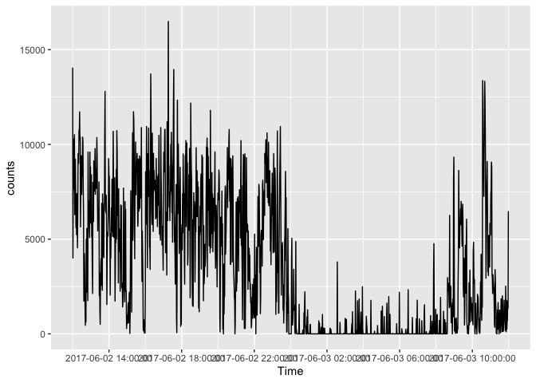
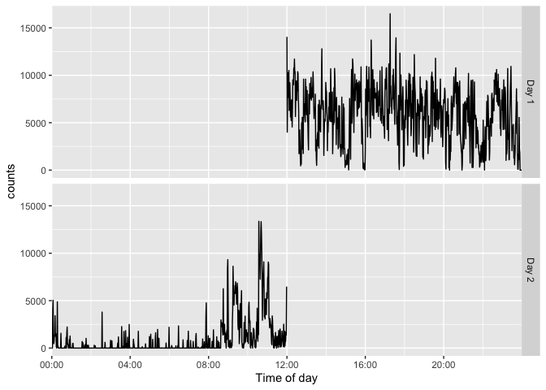
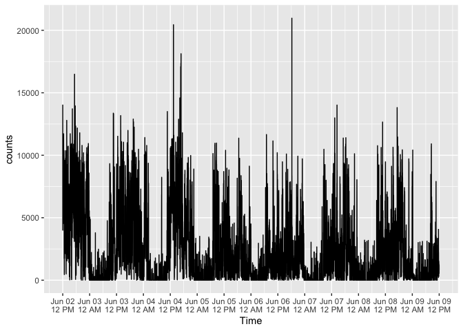
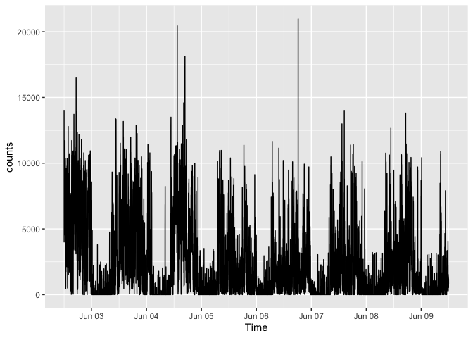
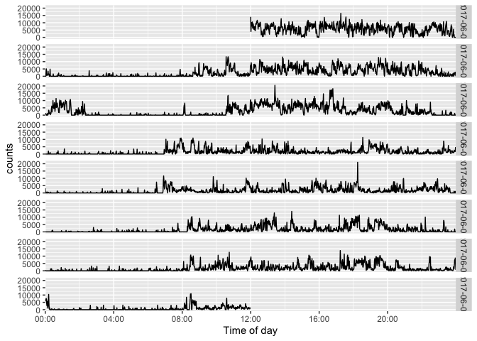

<!-- README.md is generated from README.Rmd. Please edit that file -->

<!-- badges: start -->

[](https://github.com/jhuwit/actiplot/actions/workflows/R-CMD-check.yaml)
[](https://app.codecov.io/gh/jhuwit/actiplot?branch=main)
<!-- badges: end -->

# actiplot

`actiplot` provides `ggplot2` visualizations for minute-level activity
data, including steps and activity counts. It works with the
standardized timestamp conventions used throughout the activerse.

## Example-data provenance

`acti_minute_data` is a processed minute-level recording drawn from the
[Figshare collection of upper-limb activity
data](https://springernature.figshare.com/collections/Upper_limb_activity_of_twenty_myoelectric_prosthesis_users_and_twenty_healthy_anatomically_intact_adults_/4457855)
from 20 myoelectric prosthesis users and 20 anatomically intact adults.
Please cite the original data descriptor when using it: Chadwell A,
Kenney L, Granat M, Thies S, Galpin A, and Head J (2019), [*Upper limb
activity of twenty myoelectric prosthesis users and twenty healthy
anatomically intact adults*](https://doi.org/10.1038/s41597-019-0211-6),
*Scientific Data* 6, 199.

Core entry points:

- `acti_plot_time()` for a complete activity time series
- `acti_plot_day()` for time-of-day-aligned daily rows
- `acti_plot_heatmap()` for a date-by-time activity heat map

## Installation

You can install `actiplot` from GitHub with:

``` r
# install.packages("remotes")
remotes::install_github("jhuwit/actiplot")
```

## Quick start

``` r
activity <- acti_minute_data[seq_len(1440), ]

acti_plot_time(activity, counts, breaks = "4 hours")
```

<!-- -->

``` r
acti_plot_day(activity, counts, breaks = "4 hours")
```

<!-- -->

Daily facets can use a compact month-and-day label or baseline-relative
day numbers: `facet = "month-day"` and `facet = "day"`, respectively.

``` r
acti_plot_day(activity, counts, facet = "month-day")
```

<!-- -->

``` r
acti_plot_day(activity, counts, facet = "day")
```

<!-- -->

For a complete recording, `x_axis = "12 hours"` labels midnight and noon
with both the date and a 12-hour clock. Use `x_axis = "midnight"` when a
date-only label at midnight is preferred.

``` r
acti_plot_time(acti_minute_data, counts, x_axis = "12 hours")
```

<!-- -->

``` r
acti_plot_time(acti_minute_data, counts, x_axis = "midnight")
```

<!-- -->

``` r
acti_plot_day(acti_minute_data, counts, breaks = "4 hours")
```

<!-- -->
