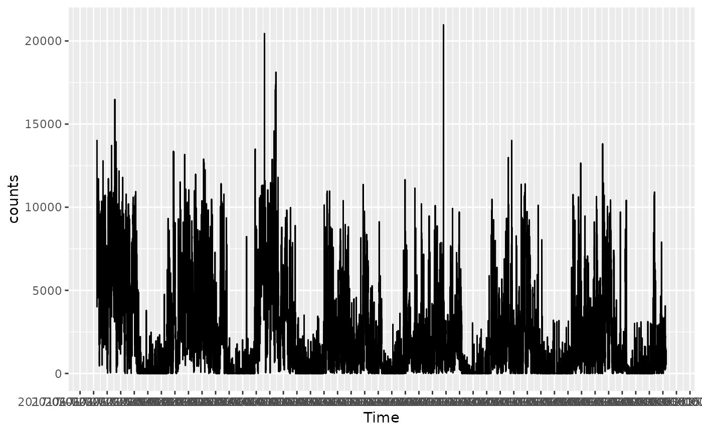
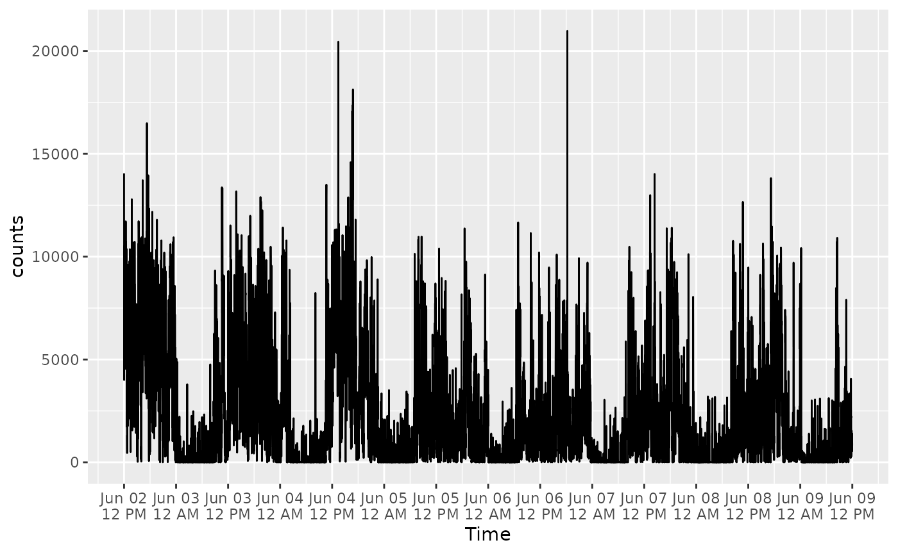
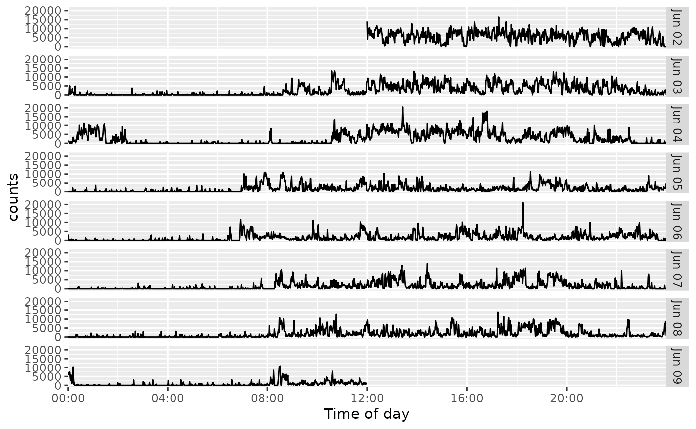
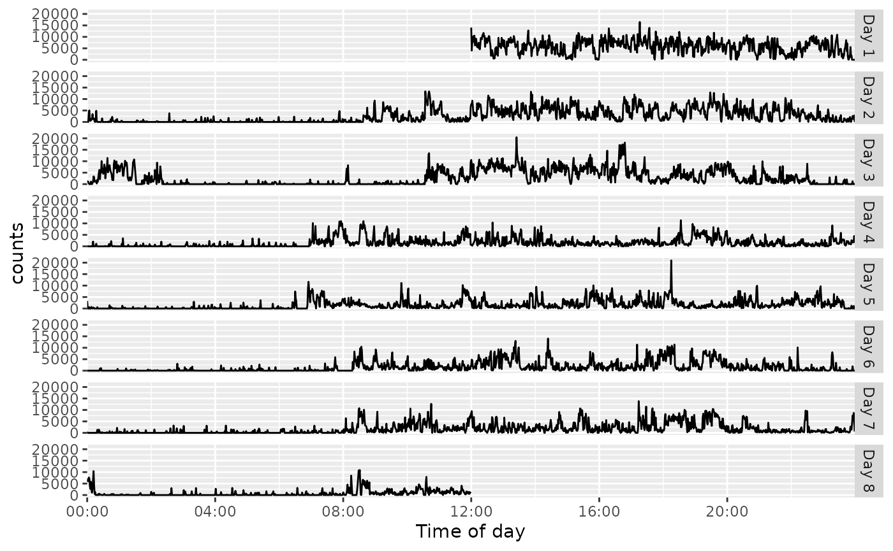
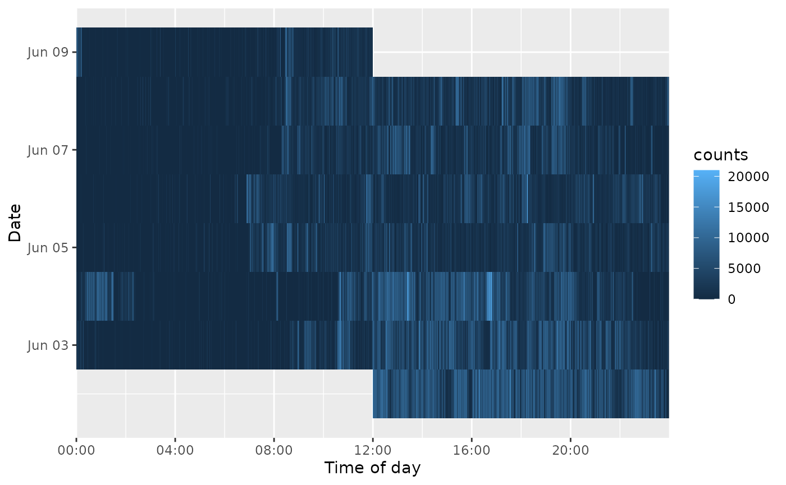

# Plotting Minute-Level Activity Data

``` r

library(actiplot)
```

This vignette uses the packaged `acti_minute_data` accelerometer
recording. It contains seven days of minute-level vector-magnitude
activity counts. It is processed from the [upper-limb activity Figshare
collection](https://springernature.figshare.com/collections/Upper_limb_activity_of_twenty_myoelectric_prosthesis_users_and_twenty_healthy_anatomically_intact_adults_/4457855)
described by [Chadwell et
al. (2019)](https://doi.org/10.1038/s41597-019-0211-6).

``` r

activity <- acti_minute_data
```

## Complete recording

Use
[`acti_plot_time()`](https://jhuwit.github.io/actiplot/reference/acti_plot_time.md)
to inspect activity across the entire recording. The `breaks` argument
accepts ordinary duration strings and sets the interval of the time-axis
labels.

``` r

acti_plot_time(activity, counts, breaks = "4 hours")
```



For a more legible complete-recording axis, set `x_axis = "12 hours"`.
It shows date and 12-hour-clock labels at midnight and noon.
Alternatively, `x_axis = "midnight"` prints just the date at midnight,
without `00:00:00`.

``` r

acti_plot_time(activity, counts, x_axis = "12 hours")
```



``` r

acti_plot_time(activity, counts, x_axis = "midnight")
```


## Daily aligned rows

Use
[`acti_plot_day()`](https://jhuwit.github.io/actiplot/reference/acti_plot_time.md)
to align each day on the same time-of-day axis. Each facet row is one
calendar date, which makes day-to-day activity patterns easy to compare.

``` r

acti_plot_day(activity, counts, breaks = "4 hours")
```


Set `facet = "month-day"` to remove the year from date strips, or
`facet = "day"` to use the baseline-relative day calculated by
[`actibase::acti_separate_times()`](https://jhuwit.github.io/actibase/reference/acti_separate_time.html).

``` r

acti_plot_day(activity, counts, facet = "month-day")
```



``` r

acti_plot_day(activity, counts, facet = "day")
```



## Date-by-time heat map

[`acti_plot_heatmap()`](https://jhuwit.github.io/actiplot/reference/acti_plot_time.md)
uses the same alignment with counts represented by fill.

``` r

acti_plot_heatmap(activity, counts, breaks = "4 hours")
```


