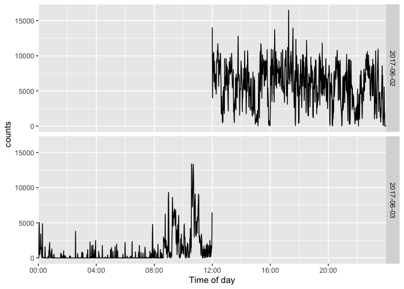

# actiplot

`actiplot` provides `ggplot2` visualizations for minute-level activity
data, including steps and activity counts. It works with the
standardized timestamp conventions used throughout the activerse.

Core entry points:

- [`acti_plot_time()`](https://jhuwit.github.io/actiplot/reference/acti_plot_time.md)
  for a complete activity time series
- [`acti_plot_day()`](https://jhuwit.github.io/actiplot/reference/acti_plot_time.md)
  for time-of-day-aligned daily rows
- [`acti_plot_heatmap()`](https://jhuwit.github.io/actiplot/reference/acti_plot_time.md)
  for a date-by-time activity heat map

## Installation

You can install `actiplot` from GitHub with:

``` r

# install.packages("remotes")
remotes::install_github("jhuwit/actiplot")
```

## Quick start

``` r

activity <- acti_minute_data[seq_len(1440), ]

acti_plot_time(activity, counts, breaks = "4 hours")
```


``` r

acti_plot_day(activity, counts, breaks = "4 hours")
```


